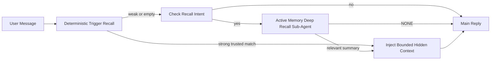

Active Memory is the deep-recall lane for eligible conversational sessions.
The default `escalate` mode runs its blocking recall sub-agent only when the
message asks about the past and the deterministic memory lane found no strong
trusted trigger match. This keeps ordinary replies fast while preserving a
deeper search path for prior decisions, conversations, and temporal or
multi-hop questions.

Flat retrieval is strongest for direct fact matches and weaker on temporal and
multi-session questions. [LongMemEval (arXiv:2410.10813)](https://arxiv.org/abs/2410.10813)
measures that gap, while the PrefEval benchmark highlights the value of
preference-adjacent reminders. Escalation by default spends the blocking model
call where those harder recall shapes are actually present.

## Remember across conversations

For a personal or fully trusted agent, enable bounded recall across its other
private conversations with one per-agent setting:

```json5
{
  agents: {
    entries: {
      personal: {
        memory: {
          search: {
            rememberAcrossConversations: true,
          },
        },
      },
    },
  },
}
```

The setting defaults on for personal installs: global `session.dmScope` must be
unset or `"main"`, and no binding may override `session.dmScope`. Any configured
DM isolation defaults it off. An explicit `true` or `false` always wins. When
enabled, OpenClaw indexes that agent's session transcripts and runs an Active
Memory retrieval pass before eligible private replies. The pass can read
relevant transcript excerpts from the same agent's other private conversations.
It excludes the conversation already being answered.

The privacy boundary is fixed:

- private direct and persistent explicit UI conversations can recall one another
- groups and channels are neither recall sources nor recall destinations
- another agent's transcripts are never eligible
- unknown or archived transcripts without enough conversation metadata are rejected

This does not merge transcripts, change session keys or delivery routes, widen
`tools.sessions.visibility`, or grant broader `sessions_*` tool access. Shared
workspace memory (`MEMORY.md` and `memory/*.md`) keeps its existing behavior.

Active Memory must remain enabled. Retrieval adds a bounded blocking step to
eligible replies; timeout, unavailable search, and empty results all continue
the reply without recalled transcript context. OpenClaw's built-in memory
provider supports this protected transcript-recall path with both the builtin
and QMD backends. Other memory providers keep their own recall behavior but do
not automatically receive private transcript authorization. `openclaw doctor`
reports an unsupported provider or missing `memory_search` tool.

## Advanced Active Memory quick start

Paste into `openclaw.json` for an advanced safe default: plugin on, scoped to
`main`, direct-message sessions only, model inherited from the session.

```json5
{
  plugins: {
    entries: {
      "active-memory": {
        enabled: true,
        config: {
          enabled: true,
          mode: "escalate",
          agents: ["main"],
          allowedChatTypes: ["direct"],
          modelFallback: "google/gemini-3-flash",
          queryMode: "recent",
          promptStyle: "balanced",
          timeoutMs: 15000,
          maxSummaryChars: 220,
          persistTranscripts: false,
          logging: true,
        },
      },
    },
  },
}
```

`plugins.entries.*` (including `active-memory.config`) is in the [no-restart
config category](/gateway/configuration#what-hot-applies-vs-what-needs-a-restart):
the Gateway reloads the plugin runtime automatically and no manual restart is
needed. If you want to force a full restart anyway, run:

```bash
openclaw gateway restart
```

To inspect it live in a conversation:

```text
/verbose on
/trace on
```

What the key fields do:

- `plugins.entries.active-memory.enabled: true` turns the plugin on
- `config.mode: "escalate"` runs deep recall only for recall intent without a strong deterministic hit
- `config.agents: ["main"]` opts only the `main` agent in
- `config.allowedChatTypes: ["direct"]` scopes it to direct-message sessions (opt in groups/channels explicitly)
- `config.model` (optional) pins a dedicated recall model; unset inherits the current session model
- `config.modelFallback` is used only when no explicit or inherited model resolves
- `config.fastMode` optionally overrides fast mode for recall without changing the main agent
- `config.promptStyle: "balanced"` is the default for `recent` mode
- active memory still runs only for eligible interactive persistent chat sessions (see [When it runs](#when-it-runs))

## How it works



The deep-recall sub-agent can call only the configured memory recall tools (see
[Memory tools](#memory-tools)). If the connection between the query and
available memory is weak, it returns `NONE` and the main reply proceeds
without extra context.

Active memory is a conversational enrichment feature, not a platform-wide
inference feature:

| Surface                                                             | Runs active memory?                                      |
| ------------------------------------------------------------------- | -------------------------------------------------------- |
| Control UI / web chat persistent sessions                           | Yes, when either activation path targets the agent       |
| Other interactive channel sessions on the same persistent chat path | Yes, when either activation path allows the conversation |
| Headless one-shot runs                                              | No                                                       |
| Heartbeat/background runs                                           | No                                                       |
| Generic internal `agent-command` paths                              | No                                                       |
| Sub-agent/internal helper execution                                 | No                                                       |

Use it when the session is persistent and user-facing, the agent has
meaningful long-term memory to search, and continuity/personalization matter
more than raw prompt determinism: stable preferences, recurring habits,
long-term context that should surface naturally. It is a poor fit for
automation, internal workers, one-shot API tasks, or anywhere hidden
personalization would be surprising.

## When it runs

Active Memory has two targeting paths for the deep-recall lane:

1. **Remember across conversations** automatically targets agents whose
   effective `memory.search.rememberAcrossConversations` setting is enabled, but
   only for private direct or persistent explicit UI conversations.
2. **Advanced Active Memory** targets agent IDs listed in
   `plugins.entries.active-memory.config.agents` and applies the plugin's chat
   type and chat ID controls.

Both paths require the plugin to be enabled and an eligible interactive
persistent conversation. A session-scoped `/active-memory off` pauses both
paths for that conversation. If any condition fails, active memory does not run
for that turn, and the main reply is unaffected.

`config.mode` controls when a targeted turn starts the blocking sub-agent:

| Mode       | Behavior                                                                |
| ---------- | ----------------------------------------------------------------------- |
| `escalate` | Default. Run only for recall intent when lane 1 has no strong hit.      |
| `always`   | Preserve the previous behavior and run on every eligible targeted turn. |
| `off`      | Disable deep recall without unloading the plugin.                       |

The deterministic trusted-trigger lane remains available in `off` mode.
`rememberAcrossConversations` is unchanged: it still controls whether deep
recall may search other private conversations.

### Session types

`config.allowedChatTypes` controls which kinds of conversations may run the
advanced Active Memory path. It cannot widen Remember across conversations:
that product setting remains private-only even when advanced Active Memory is
allowed in groups or channels. Default:

```json5
allowedChatTypes: ["direct"];
```

Valid values: `direct`, `group`, `channel`, `explicit` (portal-style sessions
with an opaque session id, for example `agent:main:explicit:portal-123`).
Direct-message sessions run by default; group, channel, and explicit sessions
need to be opted in:

```json5
allowedChatTypes: ["direct", "group"];
allowedChatTypes: ["direct", "group", "channel"];
```

For narrower rollout inside an allowed chat type, add
`config.allowedChatIds` and `config.deniedChatIds`:

- `allowedChatIds` is an allowlist of resolved conversation ids. When
  non-empty, active memory only runs for sessions whose conversation id is in
  the list — this narrows **every** allowed chat type at once, including
  direct messages. To keep all direct messages while narrowing only groups,
  add the direct peer ids to `allowedChatIds` too, or keep `allowedChatTypes`
  scoped to the group/channel rollout you are testing.
- `deniedChatIds` is a denylist that always wins over `allowedChatTypes` and
  `allowedChatIds`.

Ids come from the persistent channel session key (for example Feishu
`chat_id`/`open_id`, Telegram chat id, Slack channel id). Matching is
case-insensitive. If `allowedChatIds` is non-empty and OpenClaw cannot
resolve a conversation id for the session, active memory skips the turn
instead of guessing.

```json5
allowedChatTypes: ["direct", "group"],
allowedChatIds: ["ou_operator_open_id", "oc_small_ops_group"],
deniedChatIds: ["oc_large_public_group"]
```

## Session toggle

Pause or resume active memory for the current chat session without editing
config:

```text
/active-memory status
/active-memory off
/active-memory on
```

This only affects the current session; it does not change
`plugins.entries.active-memory.config.enabled`, an agent's
`memory.search.rememberAcrossConversations` setting, or other global
configuration.

To pause/resume for all sessions instead, use the global form (requires
owner or `operator.admin`):

```text
/active-memory status --global
/active-memory off --global
/active-memory on --global
```

The global form writes `plugins.entries.active-memory.config.enabled` but
leaves `plugins.entries.active-memory.enabled` on, so the command stays
available to turn active memory back on later.

## How to see it

By default, active memory injects a hidden untrusted prompt prefix that is
not shown in the normal reply. Turn on the session toggles that match the
output you want:

```text
/verbose on
/trace on
```

With those on, OpenClaw appends diagnostic lines after the normal reply (as a
follow-up, so channel clients do not flash a separate pre-reply bubble):

- `/verbose on` adds a status line: `🧩 Active Memory: status=ok elapsed=842ms query=recent summary=34 chars`
- `/trace on` adds a debug summary: `🔎 Active Memory Debug: Lemon pepper wings with blue cheese.`

Example flow:

```text
/verbose on
/trace on
what wings should i order?
```

```text
...normal assistant reply...

🧩 Active Memory: status=ok elapsed=842ms query=recent summary=34 chars
🔎 Active Memory Debug: Lemon pepper wings with blue cheese.
```

With `/trace raw`, the traced `Model Input (User Role)` block shows the raw
hidden prefix:

```text
Context:
<active_memory_plugin>
...
</active_memory_plugin>
```

By default the blocking sub-agent's transcript is temporary and deleted after
the run completes; see [Transcript persistence](#transcript-persistence) to
keep it.

## Query modes

`config.queryMode` controls how much conversation the blocking sub-agent
sees. Pick the smallest mode that still answers follow-ups well; grow
`timeoutMs` as context size grows, from `message` to `recent` to `full`.

<Tabs>
  <Tab title="message">
    Only the latest user message is sent.

    ```text
    Latest user message only
    ```

    Use when you want the fastest behavior, the strongest bias toward stable
    preference recall, and follow-up turns do not need conversational
    context. Start around `3000`-`5000` ms for `config.timeoutMs`.

  </Tab>

  <Tab title="recent">
    The latest user message plus a small recent conversational tail.

    ```text
    Recent conversation tail:
    user: ...
    assistant: ...
    user: ...

    Latest user message:
    ...
    ```

    Use for a balance of speed and conversational grounding, when follow-up
    questions often depend on the last few turns. Start around `15000` ms.

  </Tab>

  <Tab title="full">
    The full conversation is sent to the blocking sub-agent.

    ```text
    Full conversation context:
    user: ...
    assistant: ...
    user: ...
    ...
    ```

    Use when recall quality matters more than latency, or important setup is
    far back in the thread. Start around `15000` ms or higher depending on
    thread size.

  </Tab>
</Tabs>

## Prompt styles

`config.promptStyle` controls how eager or strict the sub-agent is about
returning memory:

| Style             | Behavior                                                                   |
| ----------------- | -------------------------------------------------------------------------- |
| `balanced`        | General-purpose default for `recent` mode                                  |
| `strict`          | Least eager; minimal bleed from nearby context                             |
| `contextual`      | Most continuity-friendly; conversation history matters more                |
| `recall-heavy`    | Surfaces memory on softer but still plausible matches                      |
| `precision-heavy` | Aggressively prefers `NONE` unless the match is obvious                    |
| `preference-only` | Optimized for favorites, habits, routines, taste, recurring personal facts |

Default mapping when `config.promptStyle` is unset:

```text
message -> strict
recent -> balanced
full -> contextual
```

An explicit `config.promptStyle` always overrides the mapping.

## Model fallback policy

If `config.model` is unset, active memory resolves a model in this order:

```text
explicit plugin model (config.model)
-> current session model
-> agent primary model
-> optional configured fallback model (config.modelFallback)
```

```json5
modelFallback: "google/gemini-3-flash";
```

If nothing in that chain resolves, active memory skips recall for the turn.
`config.modelFallbackPolicy` is a deprecated compatibility field kept for
older configs; it no longer changes runtime behavior — `modelFallback` is
strictly the last resort in the chain above, not a runtime failover that
swaps in another model when the resolved one errors.

### Speed recommendations

Leaving `config.model` unset (inherit the session model) is the safest
default: it follows your existing provider, auth, and model preferences. For
lower latency, use a dedicated fast model instead — recall quality matters,
but latency matters more here than on the main answer path, and the tool
surface is narrow (only memory recall tools).

Good fast-model options:

- `cerebras/gpt-oss-120b`, a dedicated low-latency recall model
- `google/gemini-3-flash`, a low-latency fallback without changing your primary chat model
- your normal session model, by leaving `config.model` unset

#### Cerebras setup

```json5
{
  models: {
    providers: {
      cerebras: {
        baseUrl: "https://api.cerebras.ai/v1",
        apiKey: "${CEREBRAS_API_KEY}",
        api: "openai-completions",
        models: [{ id: "gpt-oss-120b", name: "GPT OSS 120B (Cerebras)" }],
      },
    },
  },
  plugins: {
    entries: {
      "active-memory": {
        enabled: true,
        config: { model: "cerebras/gpt-oss-120b" },
      },
    },
  },
}
```

Confirm the Cerebras API key has `chat/completions` access for the chosen
model — `/v1/models` visibility alone does not guarantee it.

## Memory tools

`config.toolsAllow` sets the concrete tool names the blocking sub-agent may
call for advanced Active Memory. Defaults depend on the current memory provider:

| Memory provider | Default `toolsAllow`              |
| --------------- | --------------------------------- |
| Built-in memory | `["memory_search", "memory_get"]` |
| LanceDB         | `["memory_recall"]`               |

If none of the configured tools are available, or the sub-agent run fails,
active memory skips recall for that turn and the main reply continues
without memory context. For custom recall tools, non-empty model-visible
tool output counts as recall evidence unless structured result fields
explicitly report an empty result or failure.

`toolsAllow` only accepts concrete memory tool names: wildcards, `group:*`
entries, and core agent tools (`read`, `exec`, `message`, `web_search`, and
similar) are silently filtered out before the hidden sub-agent starts.

### Built-in memory

No explicit `toolsAllow` needed:

```json5
{
  plugins: {
    entries: {
      "active-memory": {
        enabled: true,
        config: {
          agents: ["main"],
          // Default: ["memory_search", "memory_get"]
        },
      },
    },
  },
}
```

### LanceDB memory

After [installing and configuring LanceDB](/plugins/memory-lancedb), Active
Memory automatically uses `memory_recall`; no explicit `toolsAllow` is needed:

```json5
{
  plugins: {
    entries: {
      "active-memory": {
        enabled: true,
        config: {
          agents: ["main"],
          promptAppend: "Use memory_recall for long-term user preferences, past decisions, and previously discussed topics. If recall finds nothing useful, return NONE.",
        },
      },
    },
  },
}
```

This is the advanced Active Memory path for LanceDB's own stored memories.
`memory.search.rememberAcrossConversations` does not expose private session
transcripts through `memory_recall`. Use LanceDB's auto-recall or the advanced
configuration above when LanceDB is the active memory provider.

### Lossless Claw

[Lossless Claw](https://github.com/martian-engineering/lossless-claw) is an
external context-engine plugin (`openclaw plugins install
@martian-engineering/lossless-claw`) with its own recall tools. Set it up as
a context engine first; see [Context engine](/concepts/context-engine). Then
point active memory at its tools:

```json5
{
  plugins: {
    slots: {
      contextEngine: "lossless-claw",
    },
    entries: {
      "lossless-claw": {
        enabled: true,
      },
      "active-memory": {
        enabled: true,
        config: {
          agents: ["main"],
          toolsAllow: ["memory_search", "lcm_grep", "lcm_describe", "lcm_expand_query"],
          promptAppend: "Use lcm_grep first for compacted conversation recall. Use lcm_describe to inspect a specific summary. Use lcm_expand_query only when the latest user message needs exact details that may have been compacted away. Return NONE if the retrieved context is not clearly useful.",
        },
      },
    },
  },
}
```

Do not add `lcm_expand` to `toolsAllow` here; Lossless Claw uses it as a
lower-level tool for delegated expansion, not meant for the top-level
active-memory sub-agent. Lossless Claw changes context assembly without
replacing the current memory provider. Keep `memory_search` in `toolsAllow`
when also using `rememberAcrossConversations`; an LCM-only tool list remains
valid for advanced Active Memory but disables the product transcript-recall
path.

## Advanced escape hatches

Not part of the recommended setup.

`config.thinking` overrides the sub-agent's thinking level (default `"off"`,
since active memory runs in the reply path and extra thinking time directly
adds user-visible latency):

```json5
thinking: "medium"; // default: "off"
```

`config.fastMode` overrides fast mode only for the blocking memory sub-agent.
Use `true`, `false`, or `"auto"`; leave it unset to inherit the normal
agent, session, and model defaults. `"auto"` uses the recall model's configured
`fastAutoOnSeconds` cutoff:

```json5
fastMode: true;
```

`config.promptAppend` adds operator instructions after the default prompt
and before the conversation context — pair it with a custom `toolsAllow` when
a non-core memory plugin needs specific tool order or query shaping:

```json5
promptAppend: "Prefer stable long-term preferences over one-off events.";
```

`config.promptOverride` replaces the default prompt entirely (conversation
context is still appended afterward). Not recommended unless deliberately
testing a different recall contract — the default prompt is tuned to return
either `NONE` or compact user-fact context for the main model:

```json5
promptOverride: "You are a memory search agent. Return NONE or one compact user fact.";
```

## Transcript persistence

Blocking sub-agent runs keep their runtime transcript in the agent's SQLite
store. By default, OpenClaw removes the temporary sub-agent session rows after
the run finishes and does not create a JSONL file.

To export those transcripts as JSONL artifacts for debugging:

```json5
{
  plugins: {
    entries: {
      "active-memory": {
        enabled: true,
        config: {
          agents: ["main"],
          persistTranscripts: true,
          transcriptDir: "active-memory",
        },
      },
    },
  },
}
```

Exported transcript artifacts go under the target agent's sessions folder, in
a separate directory from active runtime state:

```text
agents/<agent>/sessions/active-memory/<blocking-memory-sub-agent-session-id>.jsonl
```

Change the relative artifact subdirectory with `config.transcriptDir`. Use this
carefully: exports can accumulate quickly on busy sessions, `full` query mode
duplicates a lot of conversation context, and these artifacts contain hidden
prompt context plus recalled memories.

## Configuration

All active memory configuration lives under `plugins.entries.active-memory`.

| Key                          | Type                                                                                                 | Meaning                                                                                                                                                                                                                                           |
| ---------------------------- | ---------------------------------------------------------------------------------------------------- | ------------------------------------------------------------------------------------------------------------------------------------------------------------------------------------------------------------------------------------------------- |
| `enabled`                    | `boolean`                                                                                            | Enables the plugin itself                                                                                                                                                                                                                         |
| `config.mode`                | `"escalate" \| "always" \| "off"`                                                                    | Controls when the blocking deep-recall sub-agent runs; default `"escalate"`                                                                                                                                                                       |
| `config.agents`              | `string[]`                                                                                           | Agent ids that may use active memory                                                                                                                                                                                                              |
| `config.model`               | `string`                                                                                             | Optional blocking sub-agent model ref; when unset, inherits the current session model                                                                                                                                                             |
| `config.allowedChatTypes`    | `("direct" \| "group" \| "channel" \| "explicit")[]`                                                 | Session types that may run active memory; defaults to `["direct"]`                                                                                                                                                                                |
| `config.allowedChatIds`      | `string[]`                                                                                           | Optional per-conversation allowlist applied after `allowedChatTypes`; non-empty lists fail closed                                                                                                                                                 |
| `config.deniedChatIds`       | `string[]`                                                                                           | Optional per-conversation denylist that overrides allowed session types and allowed ids                                                                                                                                                           |
| `config.queryMode`           | `"message" \| "recent" \| "full"`                                                                    | Controls how much conversation the blocking sub-agent sees                                                                                                                                                                                        |
| `config.promptStyle`         | `"balanced" \| "strict" \| "contextual" \| "recall-heavy" \| "precision-heavy" \| "preference-only"` | Controls how eager or strict the blocking sub-agent is when deciding whether to return memory                                                                                                                                                     |
| `config.toolsAllow`          | `string[]`                                                                                           | Concrete memory tool names the blocking sub-agent may call; defaults to `["memory_search", "memory_get"]`, or `["memory_recall"]` when `plugins.slots.memory` is `memory-lancedb`; wildcards, `group:*` entries, and core agent tools are ignored |
| `config.thinking`            | `"off" \| "minimal" \| "low" \| "medium" \| "high" \| "xhigh" \| "adaptive" \| "max" \| "ultra"`     | Advanced thinking override for the blocking sub-agent; default `off` for speed                                                                                                                                                                    |
| `config.fastMode`            | `boolean \| "auto"`                                                                                  | Optional fast-mode override for the blocking sub-agent; unset inherits normal agent, session, and model defaults                                                                                                                                  |
| `config.promptOverride`      | `string`                                                                                             | Advanced full prompt replacement; not recommended for normal use                                                                                                                                                                                  |
| `config.promptAppend`        | `string`                                                                                             | Advanced extra instructions appended to the default or overridden prompt                                                                                                                                                                          |
| `config.timeoutMs`           | `number`                                                                                             | Hard timeout for the blocking sub-agent (range 250-120000 ms; default 15000)                                                                                                                                                                      |
| `config.setupGraceTimeoutMs` | `number`                                                                                             | Advanced extra setup budget before the recall timeout expires; range 0-30000 ms, default 0. See [Cold-start grace](#cold-start-grace) for v2026.4.x upgrade guidance                                                                              |
| `config.maxSummaryChars`     | `number`                                                                                             | Maximum characters in the active-memory summary (range 40-1000; default 220)                                                                                                                                                                      |
| `config.logging`             | `boolean`                                                                                            | Emits active memory logs while tuning                                                                                                                                                                                                             |
| `config.persistTranscripts`  | `boolean`                                                                                            | Exports blocking sub-agent transcripts as JSONL artifacts before removing their temporary SQLite session rows                                                                                                                                     |
| `config.transcriptDir`       | `string`                                                                                             | Relative transcript-artifact directory under the agent sessions folder (default `"active-memory"`)                                                                                                                                                |
| `config.modelFallback`       | `string`                                                                                             | Optional model used only as the last step in the [model fallback chain](#model-fallback-policy)                                                                                                                                                   |
| `config.qmd.searchMode`      | `"inherit" \| "search" \| "vsearch" \| "query"`                                                      | Overrides the QMD search mode used by the blocking sub-agent; default `"search"` (fast lexical search) — use `"inherit"` to match the main memory backend setting                                                                                 |

Useful tuning fields:

| Key                                | Type     | Meaning                                                                                                                                                         |
| ---------------------------------- | -------- | --------------------------------------------------------------------------------------------------------------------------------------------------------------- |
| `config.recentUserTurns`           | `number` | Prior user turns to include when `queryMode` is `recent` (range 0-4; default 2)                                                                                 |
| `config.recentAssistantTurns`      | `number` | Prior assistant turns to include when `queryMode` is `recent` (range 0-3; default 1)                                                                            |
| `config.recentUserChars`           | `number` | Max chars per recent user turn (range 40-1000; default 220)                                                                                                     |
| `config.recentAssistantChars`      | `number` | Max chars per recent assistant turn (range 40-1000; default 180)                                                                                                |
| `config.cacheTtlMs`                | `number` | Cache reuse for repeated identical queries (range 1000-120000 ms; default 15000)                                                                                |
| `config.circuitBreakerMaxTimeouts` | `number` | Skip recall after this many consecutive timeouts for the same agent/model. Resets on a successful recall or after the cooldown expires (range 1-20; default 3). |
| `config.circuitBreakerCooldownMs`  | `number` | How long to skip recall after the circuit breaker trips, in ms (range 5000-600000; default 60000).                                                              |

## Recommended setup

Start with `recent`:

```json5
{
  plugins: {
    entries: {
      "active-memory": {
        enabled: true,
        config: {
          agents: ["main"],
          mode: "escalate",
          queryMode: "recent",
          promptStyle: "balanced",
          timeoutMs: 15000,
          maxSummaryChars: 220,
          logging: true,
        },
      },
    },
  },
}
```

Use `/verbose on` for the status line and `/trace on` for the debug summary
while tuning — both are sent as a follow-up after the main reply, not
before. Use `always` only when every eligible turn warrants the latency. Keep
`escalate` for the recommended balance, then choose `message`, `recent`, or
`full` for the deep-recall query itself.

### Cold-start grace

Before v2026.5.2 the plugin silently extended `timeoutMs` by an extra 30000
ms during cold start, so model warm-up, embedding-index load, and the first
recall could share one larger budget. v2026.5.2 moved that grace behind an
explicit `setupGraceTimeoutMs` config: `timeoutMs` is now the recall-work
budget by default unless you opt in. The blocking hook wraps that budget in
two fixed phases: up to 1500 ms for session/config preflight before recall
starts, then a separate fixed 1500 ms for abort settlement and transcript
recovery after recall work stops. Neither allowance extends model or tool
execution.

If you upgraded from v2026.4.x and tuned `timeoutMs` for the old
implicit-grace world (the recommended starter `timeoutMs: 15000` is one
example), set `setupGraceTimeoutMs: 30000` to restore the pre-v5.2 effective
budget:

```json5
{
  plugins: {
    entries: {
      "active-memory": {
        config: {
          timeoutMs: 15000,
          setupGraceTimeoutMs: 30000,
        },
      },
    },
  },
}
```

Worst-case blocking time is `timeoutMs + setupGraceTimeoutMs + 3000` ms (the
configured recall-work budget, plus up to 1500 ms preflight, plus a fixed
1500 ms post-recall completion allowance). The embedded recall runner uses
the same effective timeout budget, so `setupGraceTimeoutMs` covers both the
outer prompt-build watchdog and the inner blocking recall run.

For resource-tight gateways where cold-start latency is an accepted
trade-off, lower values (5000-15000 ms) work too — the trade-off is a higher
chance of the very first recall after a gateway restart returning empty
while warm-up finishes.

## Debugging

If active memory is not showing up where you expect:

1. Confirm the plugin is enabled under `plugins.entries.active-memory.enabled`.
2. For Remember across conversations, confirm the agent's effective
   `memory.search.rememberAcrossConversations` setting is enabled, run
   `openclaw doctor` to verify the current memory provider supports protected
   transcript recall, and confirm `config.toolsAllow` includes `memory_search`
   when explicitly configured. For advanced Active Memory, confirm the agent ID
   is listed in `config.agents`.
3. Confirm you are testing through an eligible interactive persistent conversation.
4. Remember that groups and channels never use cross-conversation transcript recall.
5. Turn on `config.logging: true` and watch the gateway logs.
6. Verify memory search itself works with `openclaw status --deep`.

If memory hits are noisy, tighten `maxSummaryChars`. If active memory is too
slow, lower `queryMode`, lower `timeoutMs`, or reduce recent turn counts and
per-turn char caps.

## Common issues

Advanced Active Memory rides on the configured memory plugin's recall
pipeline, so most recall surprises are embedding-provider problems, not
active-memory bugs. The default `memory-core` path uses `memory_search` and
`memory_get`; the `memory-lancedb` slot uses `memory_recall`. If you use another
memory plugin, confirm `config.toolsAllow` names the tools that plugin actually
registers. Remember across conversations is narrower: the current memory
provider must support OpenClaw's protected same-agent/private-session recall
path.

<AccordionGroup>
  <Accordion title="Embedding provider switched or stopped working">
    If `memory.search.provider` is unset, OpenClaw uses OpenAI embeddings. Set
    `memory.search.provider` explicitly for Bedrock, DeepInfra, Gemini, GitHub
    Copilot, LM Studio, local, Mistral, Ollama, Voyage, or OpenAI-compatible
    embeddings. If the configured provider cannot run, `memory_search` may
    degrade to lexical-only retrieval; runtime failures after a provider is
    already selected do not fall back automatically.

    Set an optional `memory.search.fallback` only when you want a deliberate
    single fallback. See [Memory Search](/concepts/memory-search) for the full
    list of providers and examples.

  </Accordion>

  <Accordion title="Recall feels slow, empty, or inconsistent">
    - Turn on `/trace on` to surface the plugin-owned Active Memory debug
      summary in the session.
    - Turn on `/verbose on` to also see the `🧩 Active Memory: ...` status line
      after each reply.
    - Watch gateway logs for `active-memory: ... start|done`,
      `memory sync failed (search-bootstrap)`, or provider embedding errors.
    - Run `openclaw status --deep` to inspect the memory-search backend and
      index health.
    - If you use `ollama`, confirm the embedding model is installed
      (`ollama list`).
  </Accordion>

  <Accordion title="First recall after gateway restart returns `status=timeout`">
    On v2026.5.2 and later, if cold-start setup (model warm-up + embedding
    index load) has not finished by the time the first recall fires, the run
    can hit the configured `timeoutMs` budget and return `status=timeout`
    with empty output. Gateway logs show `active-memory timeout after Nms`
    around the first eligible reply after a restart.

    See [Cold-start grace](#cold-start-grace) under Recommended setup for the
    recommended `setupGraceTimeoutMs` value.

  </Accordion>
</AccordionGroup>

## Related pages

- [Memory Search](/concepts/memory-search)
- [Memory configuration reference](/reference/memory-config)
- [Plugin SDK setup](/plugins/sdk-setup)
